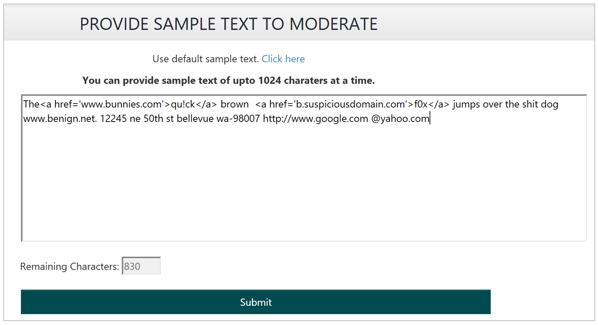

]<!-- 
NavPath: Content Moderator/Review Tool User Guide
LinkLabel: Review Moderated Text
Url: content-moderator/documentation/review-tool-user-guide/review-moderated-text
Weight: 185
-->
# Select or enter text to review #

Click the **Review** TAB to browse the auto-moderated images that are ready for review. Any labels assigned to the images are based on the default score thresholds for tagging the images. These thresholds are configurable.

Note that the images that you see on your screen are not available to other reviewers in your team while you are reviewing them.

# Get ready to review results

You can move the Reviews to display slider at the top of the screen to adjust the number of images displayed on the screen. Click on the tagged or untagged links to sort the images by tagged or untagged status respectively. Click the tags to toggle their selection status. You can also select any custom tags that you may have created. 

# Review text results

If you have thumbnails showing on your screen, click a thumbnail to bring up the detailed view. Click the tags to toggle their selection status. You can also select any custom tags that you may have created.

