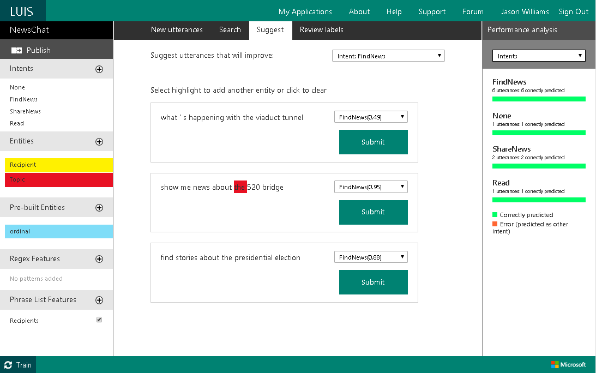

<!-- NavPath: ActiveLearning
LinkLabel: Active Learning
Url: LUIS-api/documentation/ActiveLearning
Weight: 86 -->

#Using Active Learning

The breakthrough feature of LUIS is active learning. After your endpoint has processed a few dozen interactions, you can start benefiting. In the active learning loop, LUIS examines all the utterances that have been sent to it, and calls to your attention the ones that it would like you to label. LUIS is able to critique its own work, and the utterances it points out are the ones that will give your app the biggest boost in performance. 

To use the active learning function, open your application for editing, and click on **Suggest** in the top ribbon. Next, from the drop-down menu, select a specific entity or intent, say "FindNews", and click the **search icon**. You will see currently unlabeled sentences, along with LUIS' interpretation of them. You should process these in order, starting with the first. Here is an example of what your screen will look like, depending on the queries that you have entered into the endpoint. 

The intent scores are shown in the drop-down box next to a sentence. The most likely intent is shown first, so you don't have to do anything if it is correct. Otherwise, scroll down and select the correct intent. The entities that have been detected are shown with color-coded highlighting. If an entity has been mis-labeled, click on it to correct or remove the labeling. You can also highlight and label words that LUIS neglected to label as entities. When you are done correcting a sentence, hit **Submit**. If a sentence is correct as-is, simply hit **Submit** without making any changes. 
