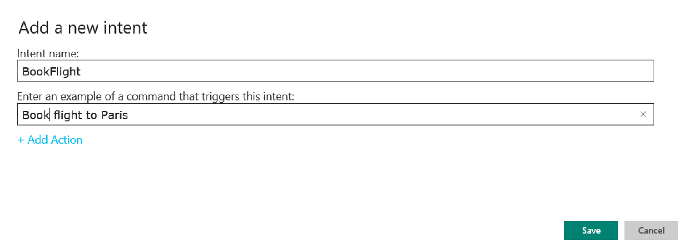

<!-- 
NavPath: LUIS API
LinkLabel: Get Started With LUIS-Basics
Url: LUIS-api/documentation/GetStartedWithLUIS-Basics
Weight: 98 
-->

#Get Started with LUIS: The Basics

LUIS lets you build your applications by using the LUIS web interface. No coding needed other than the ability to interpret and use the returned JSON in your application. It is also possible to use the [LUIS REST API](https://dev.projectoxford.ai/docs/services/56d95961e597ed0f04b76e58/) for automation of applications.

###Using LUIS for the first time

To use LUIS, first make sure that you have an up-to-date version of Microsoft Edge, Internet Explorer or Google Chrome. Go to the home page www.luis.ai and log in. You will see a screen like the one below. 


###Creating your first LUIS application

All LUIS applications are centered around a domain-specific topic, for example booking of tickets, flights, hotels, rental cars etc. or content related to exercising, tracking fitness efforts and setting goals. You need to decide on a domain-specific topic before you can create your LUIS application. In this case, let's take the example of a virtual travel booking agency application.
In the application, you will bundle together the intents and entities that are important to your task. Two intents relevant to the domain of travel booking are "BookFlight" and "GetWeather". Two entities that are important are "Location" and "DateTime". Once you have identified the intents and entities, it is possible for LUIS to take appropriate action, when a user interacts with your application. 

###Step 1: Creating an application

Click on **My Applications** and then the **New Application** button to create a new application. In the dialog box, name it "TravelAgent". Check that the application culture is set to English. Then click **Add App**. 

 

This creates the application and takes you to the LUIS Application Editor.

###Step 2: Adding intents, entities and labels

######Defining intents and labeling utterances

Next, we will add two intents to the application. At the top left of the menu panel, you will see an area for intents. All applications come with one pre-defined intent, **None**. This will recognize user statements that have nothing to do with the application, for example if someone says "Get me a great cookie recipe". 

Go ahead and click **+** next to **Intents** on the horizontal bar. You'll see a dialog box appear to add a new intent. Enter the intent name of "BookFlight", and the example command that triggers the intent as "Book flight to Paris". This will look like the screenshot below. 


Click **Save**, and the utterance will be presented for labeling. The intent "BookFlight" (just click on it) will be highlighted, and you will see a drop-down with the entities you've defined.  Click **Submit** to submit the utterance to your LUIS app.


Next, add a second intent called "GetWeather", with the example command that triggers the intent as "How is the weather in London". Click **Save**, then continue by accepting the presented utterance as a "GetWeather" intent and click **Submit**.

######Defining entities
  
On the left-hand panel, you will see an option to add entities. We'd like to be able to say what kind of travels we are interested in, and also, for planning purposes, to get an idea of what the weather is like at our travel destination. In order to capture the topic of "location", let's create the entity type: "Location". To do this, click the "**+**" button on the **Entities** bar, and fill in the resulting text entry box by typing "Location". You have now created a simple generic entity called "Location", often that is all you may need, but there are more advanced options.

######Hierarchical entities
  
You also have the ability to define relationships between entities based on hereditary hierarchical patterns. The generic entity acts as the parent and the children are the specific types, or sub-groups, under the parent, yet both share the same characteristics. For example, a generic entity may be called “Location” and the specific children of this parent may be called “ToLocation” and “FromLocation”. “Location”, including its children, has now been transformed from being a generic entity to being a specific entity. The LUIS service can recognize this type of entity and its children when labeling utterances, building models and training them. 

######Defining hierarchical entities
  
Using the “Location” example mentioned above, follow these steps. 

1.	In the Application Editor workspace, find **Entities** in the left-hand menu panel, then click the **+** sign.
2.	In the **Add a new Entity** dialog box, type "Location" as the entity name.
3.	Click the plus sign next to the **Entity Children**.
4.	In the text box that appears, type the name of the first child, "ToLocation".
5.	Click the plus sign again to add the second child, “FromLocation”, and so on.
6.	To delete a child, if you made a mistake, click the trash can sign next to the entity child.
7.	When finished, click "**Save**".


######Using Bing entities

Once your app shows a set of travel booking requests, you might want to say something like "Book me a flight to Boston on May 4". This will require understanding date words like the names of the months, for example "May", "June", dates of the month and year and so on. Rather than specifying these by hand, we can use a pre-built entity model called **datetime**. Click the **+** sign on the **Prebuilt Entities** horizontal bar and select **datetime** from the drop-down menu.

For a full list of pre-built Bing entities and their use, see [Pre-built Entities](Pre-builtEntities.md).


######Important notes on entity limits

 * Up to 10 entities of each type can be used in a single LUIS application.
 * Up to 10 children types for each parent entity may be used.
 * When adding children, make sure you add them at the same time you are creating the parent entity.
 * To delete an entity with its children, click the entity name in the left-hand panel, and then click "Delete" in the dialog box.

###Step 3: Seeding the system by labeling utterances

With a set of intents and entities defined, the next step is to provide more examples of utterances that illustrate these concepts. Click on the **New Utterances** tab at the top of the screen. Type "Book a flight to London" into the entry box and hit **Enter**. You will see a drop-down box showing the possible intents. Select "BookFlight" by highlighting it. Click on "london" and select "Location" from the drop-down box and you'll see the word "london" highlighted in yellow, indicating that you've labeled the word "london" as a "Location". Choose whether it is a "ToLocation" or "FromLocation", then click **Submit** to submit this label. 


The system needs to be seeded with several examples of each intent, and several examples of each entity. Don't forget to add an example or two of a **None** intent, for example, enter "I like ice cream". Note, that LUIS converts all utterances to lower case.

The system has now been seeded with enough data to deploy an initial application. That is done by training and publishing a model.

###Step 4: Training

When you "train" a model, LUIS generalizes from the examples you have labeled, and develops code to recognize the relevant intents and entities in the future. Internally, LUIS uses logistic regression classifiers to determine intents, and conditional random fields (CRFs) to determine the entities. The training process results in optimized classifiers and CRFs, referred to as models, that LUIS can use in the future. To do training, just click the **Train** button at the left bottom corner of the page. Training also occurs automatically with regular intervals. 

###Step 5: Publishing a model

The next step is to deploy the model to an HTTP endpoint that will interpret the sentences we send it. Click the **Publish** button in the upper left-hand corner, and then **Publish web service** in the resulting window. After a couple of moments, you will see a url that makes your model available as a web service. LUIS will look like the below screenshot. To acquire a subscription key, see [Creating Subscription Keys Via Azure Ibiza](AzureIbizaSubscription.md).

 

######Understanding the JSON response

Below find an example of intents and hierarchical entities with their children as JSON output. 

1. Set the URL parameter to be your query/utterance, for example, "Book me a flight to Boston on May 4", then click **Update published application**..
2. Hit the **Enter** key or click on the generated URL in the dialog box. 
```
{
  "query": "Book me a flight to Boston on May 4",
  "intents": [
    {
      "intent": "BookFlight",
      "score": 0.919818342
    },
    {
      "intent": "None",
      "score": 0.136909246
    },
    {
      "intent": "GetWeather",
      "score": 0.007304534
    }
  ],
  "entities": [
    {
      "entity": "boston",
      "type": "Location::ToLocation",
      "startIndex": 20,
      "endIndex": 25,
      "score": 0.621795356
    },
    {
      "entity": "may 4",
      "type": "builtin.datetime.date",
      "startIndex": 30,
      "endIndex": 34,
      "resolution": {
        "date": "XXXX-05-04"
      }
    }
  ]
}

```
Field 	| Json type	| Description of content in example
------|------|------|
Query	| string	| Query/utterance: "Book me a flight to Boston on May 4"
Intents	| object	| All intents listed (each with their highest score): "BookFlight", "None", "GetWeather"
Score	| number	| Confidence score, between 0 and 1. Only the highest score is listed for each intent.
Entities	 | object	| "boston", Type: Location::ToLocation (parent::child). "may 4", Type: builtin.datetime.date
Score |	number	|  Confidence score, between 0 and 1. Only the highest score is listed for each entity.
"date"	| string	| "XXXX-05-04"

###Summary

You have now built a basic LUIS application. This application can be enhanced by adding more [advanced features](GetStartedWithLUIS-Advanced.md).

