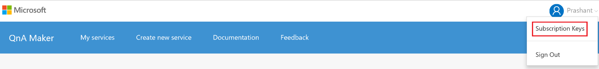
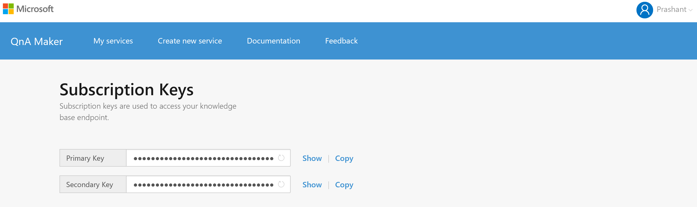

<!-- 
NavPath: QnA Maker
LinkLabel: Subscription keys
Url: QnAMaker/documentation/subkeys
Weight: 86 
-->

# Subscription keys #
Each MSA login to the tool is assigned a subscription key. This subscription key is used to track your usage of the service and need to be part of every request, as mentioned in the API section.
To view your subscription keys, go to Subscription keys.

Here you can view and also refresh your subscription keys, if you suspect they have been compromised.

Since currently the QnA Maker is a free to use tool, we have the following restrictions of usage per subscription key: **10,000 transactions per month, 10 per minute.**
