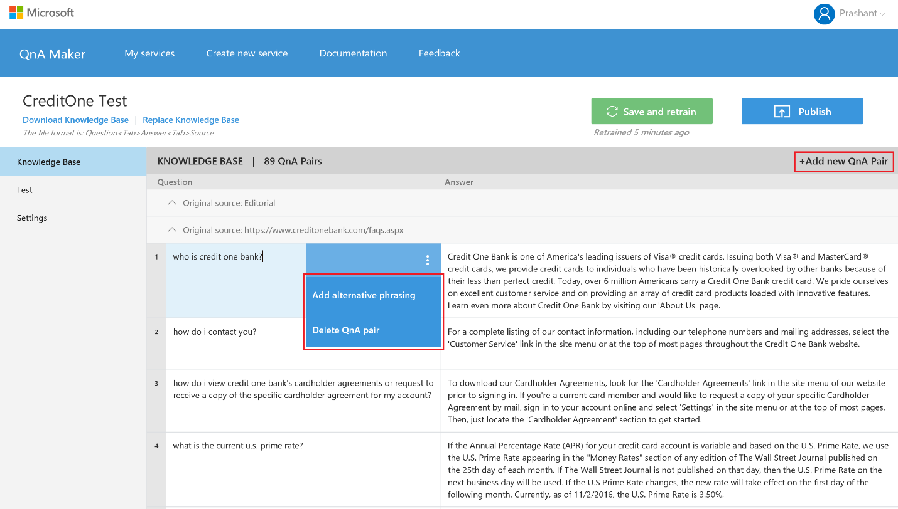
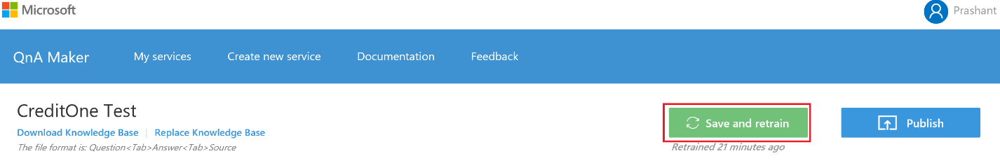
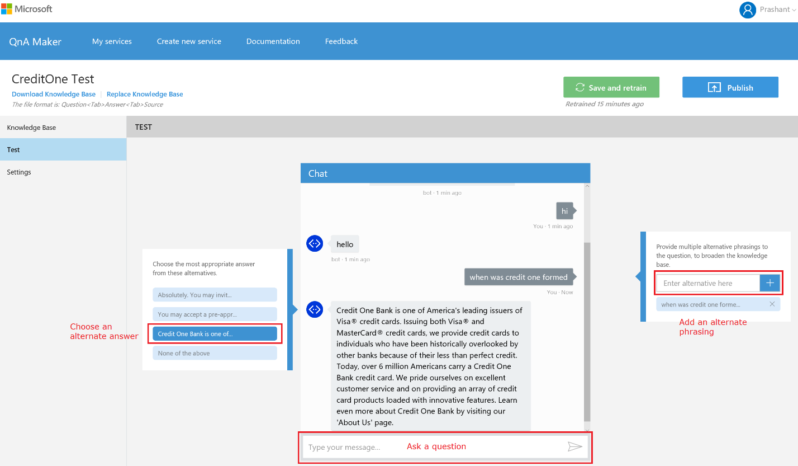
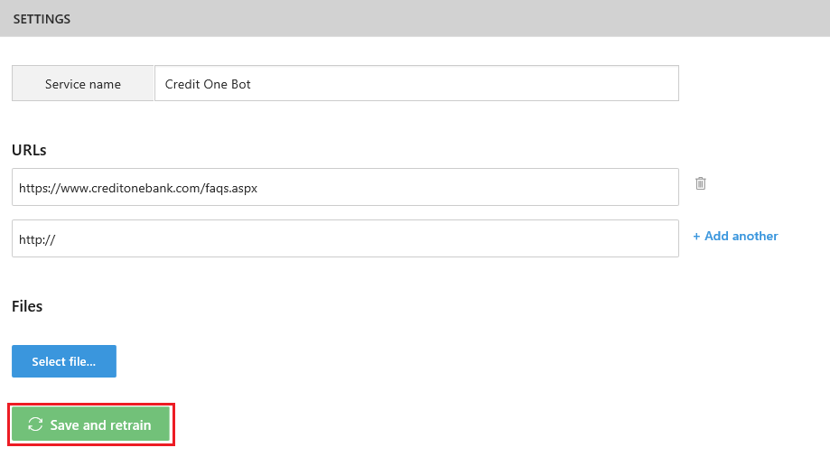
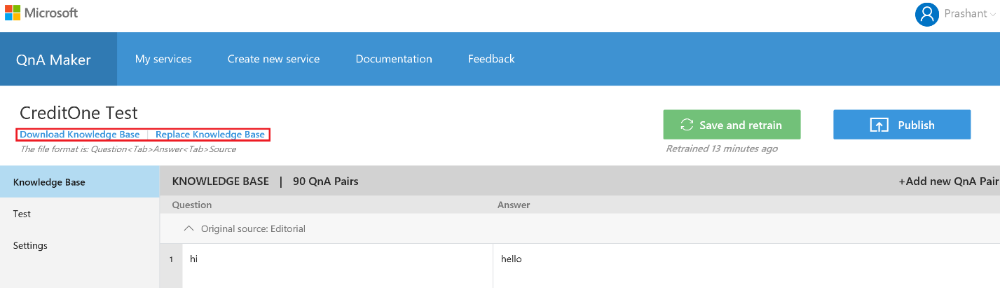

<!-- 
NavPath: QnA Maker
LinkLabel: Update your knowledge base
Url: QnAMaker/documentation/updatekb
Weight: 86 
-->

# Update your knowledge base #
There are several ways you might want to update your knowledge base.

## Update the QnA pairs ##
Edit the table of QnA directly. In addition, you can add/delete a QnA Pair, or add an alteration of an existing QnA pair. This is ideal for quick editorial fixes to your knowledge base

To save your changes, press Save and retrain button.

## Test and train ##
Chat with your knowledge base, to see the relevance of the responses. You can add a variation to an existing question as well as choose a different answer for a question

Once satisfied with the responses, press Save and retrain.

## Update the sources ##
If you need to update the sources of data of your knowledge base, go to the settings tab.

Once done with changes, click on Save and retrain

## Download and upload ##
There is also a way to replace your entire knowledge base at one go. This is ideal for bulk updates to your knowledge base.

You have an option to download the entire knowledge base by clicking on Download Knowledge Base, make changes, and then upload the knowledge base.

